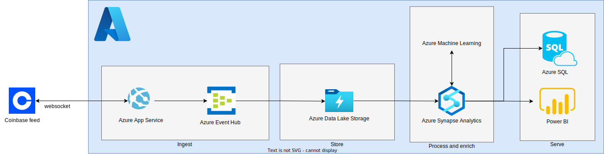

# Coinbase market data feeds insights

## 1. PoC Tool

### Assumptions
- Don't overcomplicate it (important).
- The user needs to specify a valid `product_id` when starting the application.
- We're only interested in metrics for data collected *after* the application has started. 
- The output only needs to be printed in the terminal, and not saved to a persistent datastore.
- Assumes that the `ticker_batch` channel on average sends message every 5 seconds.
  - This assumption will be used to predict the mid_price forecasts and store the resulting value in the most recent now. The function `pd.DataFrame.shift` can then be used to look 12 periods/rows back (`12 * 5s = 60s`) to get the forecasted value for the (now) most recent row.
- The market data is "linear enough" for a `LinearRegression` model to be suitable for predicting future mid prices.

### Details
- The application runs in the foreground in the terminal.
- Continuously retrain `LinearRegression` model on previous data.
- Use `resample(foo, origin="end")` to calculate averages relative to last timestamp.
- Open a websocket to the `ticker_batch` websocket channel to receive feed messages every 5 seconds.
- Calculate new columns, predict and show metrics in the terminal before retrieving the next feed message from the websocket.

### Limitations
- All data will be lost on closing the application, as the data only exists in memory.
- Performance is not optimal:
    - Looking at you, `pd.append`!
    - The `LinearRegression` model is retrained each time a feed message is received. The prediction accuracies (and model training time) will probably increase over time.

### Setup

Libraries used:
- [pandas](https://pandas.pydata.org/)
- [websockets](https://websockets.readthedocs.io/en/stable/)
- [scikit-learn](https://scikit-learn.org/stable/)
- [Typer](https://typer.tiangolo.com/)

Prerequisites:
- Python 3.11+
- [Poetry - Python dependency management and packaging made easy](https://python-poetry.org/)

Setup and installation of project dependencies:
```bash
poetry install
```

Spawn a shell within the virtual environment:
```bash
poetry shell
```

Start the application:
```bash
coinbase_insights run --product-id ETH-USD
```

Show application help:
```bash
coinbase_insights --help
```

### References
- [GitHub - python-websockets/websockets: Library for building WebSocket servers and clients in Python](https://github.com/python-websockets/websockets)
- [Advanced Trade WebSocket Channels | Coinbase Cloud](https://docs.cloud.coinbase.com/advanced-trade-api/docs/ws-channels)
- [Coinbase Websocket Channel match vs ticker - Stack Overflow](https://stackoverflow.com/questions/66683387/coinbase-websocket-channel-match-vs-ticker)
- [What is an order book? | Coinbase](https://www.coinbase.com/learn/advanced-trading/what-is-an-order-book)
- [sklearn.linear\_model.LinearRegression — scikit-learn 1.3.1 documentation](https://scikit-learn.org/stable/modules/generated/sklearn.linear_model.LinearRegression.html)


## 2. Public Cloud Architecture

Based on a subset of the architecture as described in the Analytics end-to-end with Azure Synapse architecture, which covers ingestion, storage, processing and enriching and finally serving the data to end-users to provide insights. The architecture here is similar to the *cold* path, as the real-time data doesn't need do be served live to the end users.





This particular "standard" architecure was chosen for a couple of reasons:
- Don't reinvent the wheel. Even though equivalent results can be achieved using similar services, or platforms, starting from a setup which can be later be changed based on requirements or needs is favourable.
- Familiar architecure. I've previously worked with Azure Synapse Analytics and Azure Machine Learning to process data and perform predictions, in addition to deploying applications to Azure App Service.

#### Ingest
##### Azure App Service
Deploy a containerized application to initiate a websocket connection with the Coinbase WebSocket feeds. Note that the application needs to be running as a service in order to continuously ingest the updates from the feeds, and can act as a producer client to send the received JSON payloads to Event Hub.

##### Azure Event Hub
Ingest the feeds data sent in the previous step. The event data can then be stored, either as parquet or JSON, preserving the sequence order. Also allows additional consumers to further ingest or process the data, for example in Azure Stream Analytics for a *hot* path.

#### Store
##### Azure Data Lake Storage
Persist the raw marked data feed responses in a Raw data lake layer.

#### Process and enrich
##### Azure Synapse Analytics
Batch processing of the feed data using Spark notebooks to transform the data. Synapse Analytics contains various services, such as additional storage accounts or SQL pools, to store data in various layers. Mid-prices prices can be calculated per record and averages aggregated over given time periods. 

Synapse Analytics is also tightly coupled with Azure Machine Learning, allowing forecasts to be predicted and later compared with the actual mid-price once it arrives in the pipeline, and calculate the forecasting errors and averages aggregated.

##### Azure Machine Learning
Train and invoke ML models to predict future mid-price forecasts. Existing models can be deployed, or new ones trained on existing forecast data available in one of the data layers.

#### Serve
##### Power BI
Datasets can be directly loaded from the final data layer to create visualization for the end-users.

##### Data warehouse
The final data layer can also be copied into a data warehouse for storage and further analysis of the data for more advanced end users. 


### References
- [Analytics end-to-end with Azure Synapse - Azure Architecture Center | Microsoft Learn](https://learn.microsoft.com/en-us/azure/architecture/example-scenario/dataplate2e/data-platform-end-to-end?tabs=portal)

- [What is Azure Event Hubs? - a Big Data ingestion service - Azure Event Hubs | Microsoft Learn](https://learn.microsoft.com/en-us/azure/event-hubs/event-hubs-about)